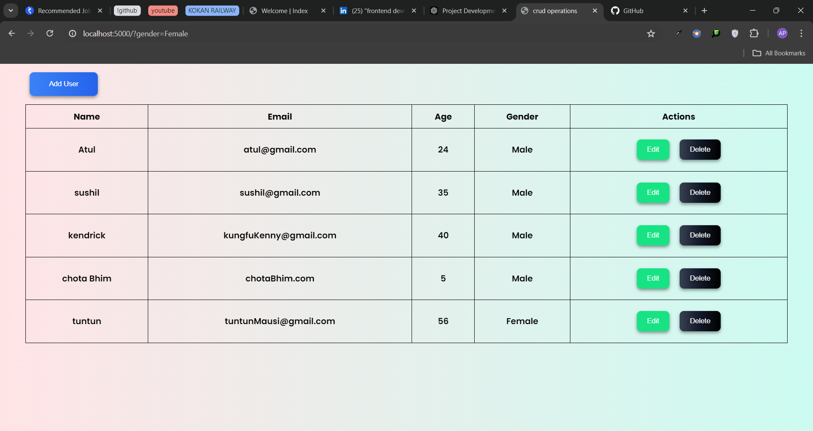

# Crud-Operations-using-Node-js-and-express
# User Management System

A simple User Management System built with Node.js, Express, MySQL, and vanilla JavaScript. This application allows users to add, edit, delete, and view user information.

## Features

- Add new users
- Update existing user information
- Delete users
- View all users in a table format



## Technologies Used

- Node.js
- Express.js
- MySQL
- JavaScript
- HTML
- CSS

## Project Structure
user-management-system/
├── public/
│   ├── index.html
│   ├── styles.css
│   └── script.js
├── routes/
│   └── user.js
├── db/
│   └── config.js
├── .env
├── package.json
├── package-lock.json
└── server.js


## Installation


## Installation

1. Clone the repository:
   ```bash
   git clone https://github.com/atulpalkar16/Crud-Operations-using-Node-js-and-express.git
   cd Crud-Operations-using-Node-js-and-express


2. install dependencies
    npm install

3. Create a .env file in the root directory and add your database configuration:
    HOST=your_database_host
    USER=your_database_user
    PASSWORD=your_database_password
    DATABASE=your_database_name
    PORT=5000

4. Set up your MySQL database:
        CREATE TABLE login.users (
        id INT AUTO_INCREMENT PRIMARY KEY,
        name VARCHAR(255) NOT NULL,
        email VARCHAR(255) NOT NULL,
        age INT NOT NULL,
        gender VARCHAR(10) NOT NULL
    );

5. Running the Application
To start the server, run the following command:
    npm start

The application will be running at http://localhost:5000.

Usage
Open your browser and navigate to http://localhost:5000.
Use the "Add User" button to open the modal for adding new users.
Fill in the user details and submit.
You can edit or delete users directly from the table.
